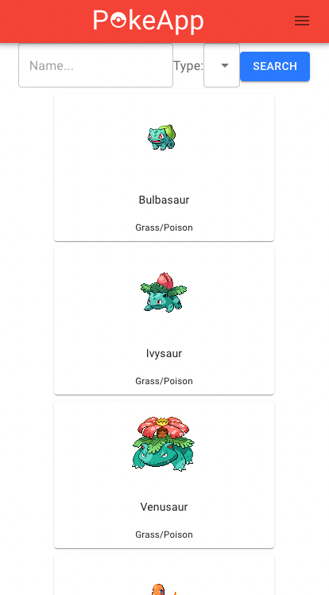

# PokeApp-Frontend

Live site link: http://pokeapp-cd.surge.sh/

### Description

This app that allows users to compile teams of six Pokemon. The user can create individual Pokemon, selecting their moves, abilities, natures and the items that they hold, as well as giving them a nickname. Once Pokemon have been created, they can be added to/removed from any existing team a user has created. Users may also select a "favorite" Pokemon which is then displayed on their profile. 

The features described above were included in order to give users an accessible means to model precise details about Pokemon teams and share them with friends.

### Tests

Frontend tests include limited smoke and snapshot testing for components not connected to the Redux store. They are located in the same folders as the components they are testing.

In order to run tests, enter `npm test` into the terminal. 

### User Flow

Users may demo the Pokemon creation feature upon entering the site without the need to create an account. If users wish to access full site functionality, they may sign up to create an account. Doing so will redirect them to select their favorite Pokemon. Once finished, the user will land on the home page.

From the home page, a registered user may select `CREATE NEW TEAM` to create and name a new empty team, or `LOAD TEAMS` to view existing teams. 

On the teams page, users can edit the team name,  add / remove Pokemon by clicking the options displayed on the cards, or delete the team entirely. 

Choosing to add a Pokemon will bring the user to their existing Pokemon not yet on the team. Pokemon can be added straight from this location, or the user can choose to create a new Pokemon. Doing so will redirect to the species menu, where they can select a Pokemon to begin building. Once selected, the user can choose the moves, abilities, etc. that they wish to add. 

Existing Pokemon:

Species Menu:

New Pokemon Form:

### APIs

This app uses the Pokemon API as well as a custom PokeApp api.

- Pokemon API: https://pokeapi.co/docs/v2
- PokeApp API: https://pokeapp-cd.herokuapp.com/

The PokeApp API was created in order to quickly load information about species, items, and natures, as well as to save and authenticate users and their created cards / teams. It follows RESTful protocols with CRUD endpoints for authorization, users, teams, cards, abilities, items, and natures.

### Technology Stack

The backend uses Express.js within a Node environment to create the endpoints for the PokeApp API. 

The frontend uses React/Redux for component usage and state management. 